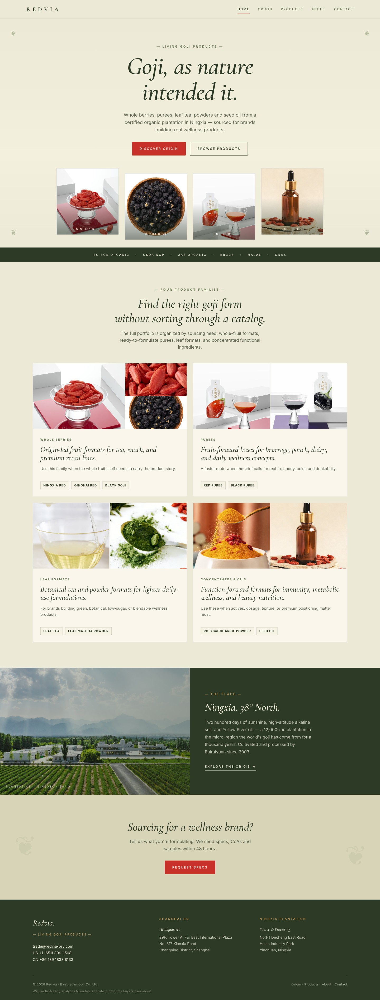
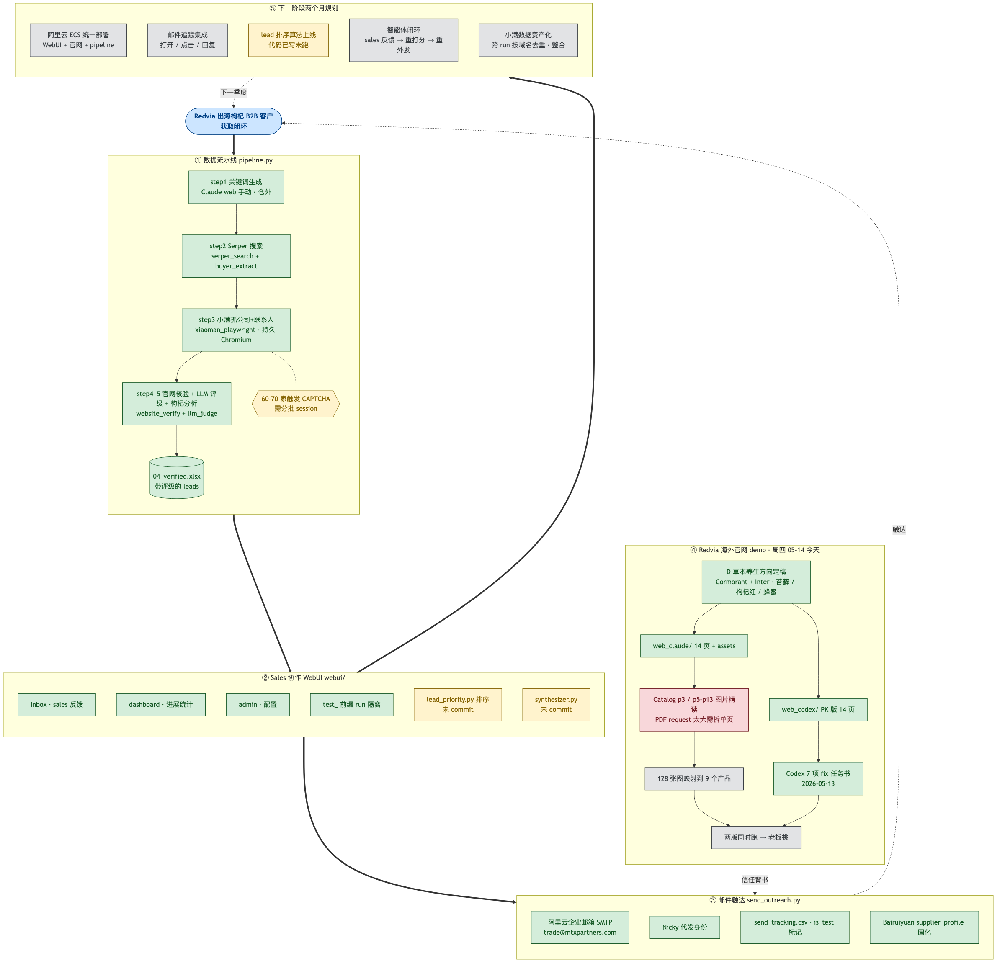

# Chuhai Pipeline

> An end-to-end outbound B2B buyer-acquisition system for a Ningxia goji berry producer expanding overseas under the **Redvia** brand. Built solo, in active use.

<p align="center">
  
</p>

---

**English** · An outbound pipeline that runs end-to-end: SERP search for overseas wholesale buyers → trade-database enrichment for contact details → website verification with an LLM judge → per-buyer persona synthesis → cold email with first-party click tracking → reply intake feeding back into the next outreach cycle. A FastAPI WebUI lets the sales team prioritise leads and review replies; a Cloudflare Worker serves the Redvia marketing site and closes the tracking loop.

**中文** · 一条从关键词到外联回复的出海客户获取流水线：Google SERP 抓买家 → 小满补全联系人 → 抓官网用 LLM 判断是否真买家 → 合成决策人画像 → 个性化邮件外联 + 一方点击追踪 → IMAP 回复回流到 sales 反馈面板触发回复合成。替代原先"靠 ChatGPT 手搜 + Excel 手清洗"的工作流，服务一家正在出海的宁夏枸杞生产商（海外品牌 Redvia）。

---

## What's inside

| Module          | Purpose                                                       | Stack                                  |
|-----------------|---------------------------------------------------------------|----------------------------------------|
| `pipeline.py`   | Five-step orchestrator with file-based checkpoints            | Python 3.12, openpyxl, dotenv          |
| `webui/`        | Sales feedback, lead priority, reply synthesis, admin         | FastAPI · HTMX · Jinja2 · SQLite       |
| `redvia-site/`  | Static marketing site at `redvia.com`                         | Vanilla HTML/CSS/JS · design tokens    |
| `cloudflare/`   | Tracking links, grounded chat, asset hosting                  | Workers · D1 · R2                      |
| LLM judge       | Provider-agnostic via any OpenAI-compatible API               | OpenAI · GLM · DeepSeek                |
| Xiaoman driver  | Headful Chromium with persistent profile + QR-code login      | Playwright                             |

See [`ARCHITECTURE.md`](ARCHITECTURE.md) for the system map, component breakdown, and data flow.

## Workflow overview

<p align="center">
  
</p>

_The annotated diagram is in Chinese; [`ARCHITECTURE.md`](ARCHITECTURE.md) is the English equivalent._

## Quick start

```bash
python -m venv .venv && source .venv/bin/activate
pip install -r requirements.txt
playwright install chromium
cp .env.example .env             # fill in keys

python pipeline.py runs/<date>_<product>/01_keywords.md
```

Optional flags: `--skip-step3` (skip Xiaoman), `--skip-contacts` (companies only, no decision-maker emails), `--skip-step4` (skip website verification), `--max-queries N`.

First run of step 3 opens a Chromium window for Xiaoman QR-code login; the session is persisted in `~/.xiaoman_playwright_profile/` so subsequent runs are non-interactive.

## Deployment

| Component       | Hosted on                  |
|-----------------|----------------------------|
| Pipeline        | Operator's Mac             |
| WebUI           | Fly.io (Singapore region)  |
| Redvia site     | Cloudflare (`redvia.com`)  |
| Tracking + chat | Cloudflare Worker + D1     |

## Status

Solo project, in active use. A few honest notes for readers:

- The pipeline still runs on the operator's Mac because Xiaoman requires an authenticated headful Chromium session. Replacing it with an API-based trade database (Apollo / Clay) is the unlock for moving the orchestrator to a cloud server.
- `webui/app.py` has grown into a ~4000-line monolith. Splitting into routers + services + db layer is the next refactor.
- Test coverage is light — `webui/test_lead_priority.py` covers the scoring rules; the rest leans on real-data smoke runs.
- A multi-person collaboration design (PR workflow, devcontainer, secret migration to corporate accounts, sales-feedback-to-issues bridge) is being written up separately.

## License

Internal project published for portfolio review. Not licensed for commercial reuse.
